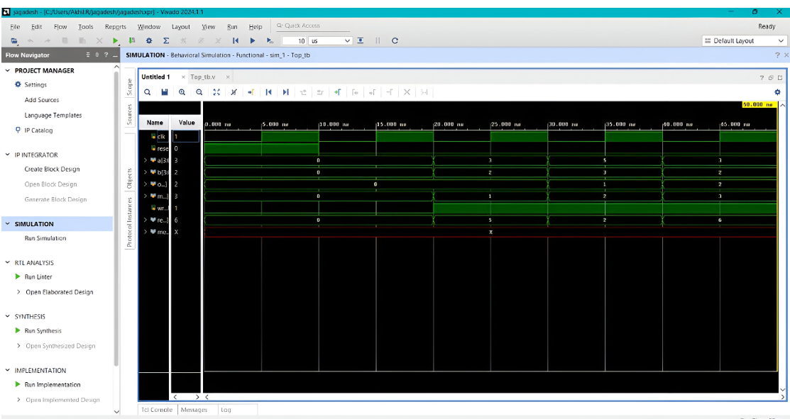

Multifunction Residue Architecture (MRA) Design

Internship Project | R.V.R. & J.C. College of Engineering
📌 Project Overview

This project focuses on the design and implementation of a Multifunction Residue Architecture (MRA) using the Residue Number System (RNS). Unlike traditional weighted number systems, RNS represents integers as a set of residues, allowing for high-speed, parallel arithmetic operations.

The system was developed using Verilog HDL and targeted for Xilinx FPGA platforms to demonstrate efficient digital signal processing (DSP) capabilities.

🛠 Tech Stack
Category	Tools / Languages

HDL	:        Verilog

Software : 	 Xilinx Vivado (2020.1 or later)

Simulation : Vivado Simulator

Hardware Target	: Xilinx Zynq-7000 / Kintex-7 Series

🏗 System Architecture

The design follows a modular RTL Design Flow, progressing from HDL entry to bitstream generation.

Core Modules:

    RNS Core: Implements parallel Addition, Subtraction, and Multiplication using modulo 16 logic.

Shared Memory: A 16×4-bit memory module acting as a common storage space for synchronized data access.

Top Module: Integrates the RNS Core and Shared Memory into a single, unified interface.

📈 Simulation Results

Verification was performed via a custom testbench to ensure the accuracy of the modular arithmetic.

## Simulation Results

[cite_start]The design was verified using the Vivado Simulator to ensure the RTL logic correctly implements the Residue Number System (RNS) arithmetic[cite: 377, 427].

### Waveform Analysis:
* [cite_start]**Clock (clk)**: Toggles every 5 time units as defined in the testbench to drive synchronous operations[cite: 622].
* [cite_start]**Reset Logic**: The system is initialized with a high `reset` signal before transitioning to low for normal operation[cite: 623].
* **Arithmetic Verification**:
    * [cite_start]**Addition**: With $a=3$, $b=2$, and `operation=00`, the `result` output correctly shows **5**[cite: 632].
    * [cite_start]**Subtraction**: With $a=5$, $b=3$, and `operation=01`, the `result` output correctly shows **2**[cite: 634].
    * [cite_start]**Multiplication**: With $a=3$, $b=2$, and `operation=10`, the `result` output correctly shows **6**[cite: 635].
* [cite_start]**Memory Integration**: The `write_enable` signal triggers when a result is ready, storing the RNS output into the `SharedMemory` at the specified `mem_address`[cite: 636, 637].
🚀 Key Learning Outcomes

    Mastered the RTL Design Flow, including design entry, simulation, and synthesis.

Gained deep insight into FPGA components like Configurable Logic Blocks (CLBs) and Programmable Interconnects.

Recognized the critical role of Software Analysis (Xilinx Vivado) in preventing errors during hardware construction.

📁 Repository Structure
Plaintext

├── src/            # Verilog Source Files (Top, RNS_Core, SharedMemory)
├── sim/            # Testbench Files
├── docs/           # Internship Report (PDF)
├── assets/         # Simulation Waveform Screenshots
└── README.md       # Project Documentation

🎓 Internship Details

    Organization: R.V.R. & J.C. College of Engineering (Autonomous).

Collaboration: SkillDzire & Andhra Pradesh State Council of Higher Education (APSCHE).

Supervision: Dr. D. Eswara Chaitanya (Associate Professor).
